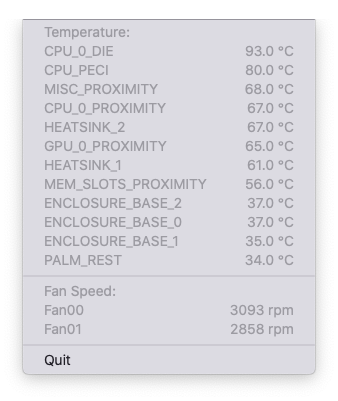
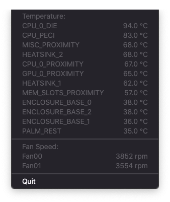

# MySensors

Minimal application which shows macOS's chip tempratures and fan speeds on menu bar without background tasks. Values only get once read when the menu gets opened.

<table>
  <tr>
    <td>
      
    </td>
    <td>
      
    </td>
  </tr>
  <tr>
    <td>
      <p align="center">Light mode</p>
    </td>
    <td>
      <p align="center">Dark mode</p>
    </td>
  </tr>
</table>

## Build

```sh
$ xcodebuild
```

## Prebuild Binary

Go to the [release page](https://github.com/aisk/MySensors/releases).

## License

MIT lisence with exceptions:

- The app icon is designed by [nervouna](https://github.com/nervouna) under MIT license.
- The menu bar icon is copied from Google's Material Design under Apache 2.0 license.
- The SMC.swift is copied from [SMCKit project](https://github.com/beltex/SMCKit) under [MIT license](https://github.com/beltex/SMCKit/blob/master/LICENSE).
